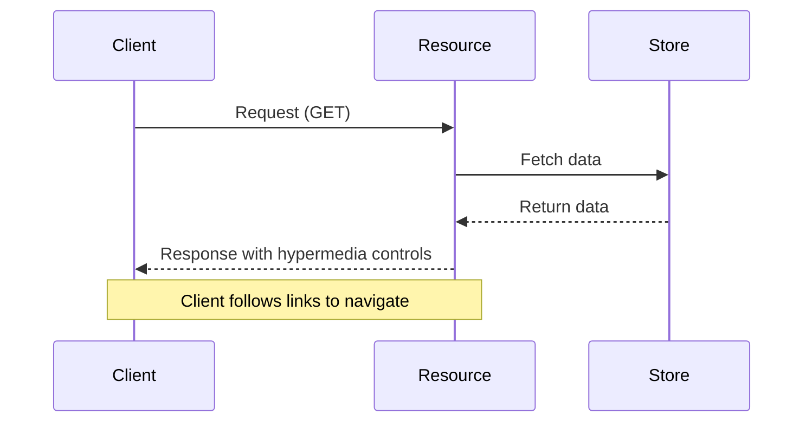

# BALAUR Documentation Diagrams

This rule provides guidance for maintaining up-to-date architectural diagrams that document the BALAUR framework.

## Description
Architectural diagrams serve as critical documentation for understanding the BALAUR framework's structure, processes, and interactions. These diagrams should be generated or updated whenever significant changes are made to the framework.

## Files
docs/diagrams/*.md, docs/diagrams/*.svg, docs/diagrams/*.png

## Instructions
- Generate or update diagrams whenever significant changes are made to:
  - Core architecture
  - Resource relationships
  - Data flow
  - State transitions
  - API interactions
  - Component hierarchies
- Use appropriate diagram types based on what's being documented:
  - Sequence diagrams for process flows and interactions
  - Class/component diagrams for object relationships
  - State diagrams for resource state transitions
  - Flow diagrams for data movement
  - Architecture diagrams for system overview
- Structure diagrams to clearly illustrate HATEOAS principles and hypermedia controls
- Include all relevant components, relationships, and interactions
- Provide clear labels and descriptive annotations
- Store diagrams in the `docs/diagrams` directory with descriptive filenames
- Use Mermaid syntax for maintainable, version-controlled diagrams
- Reference related code files and documentation in diagram headers
- Include a legend explaining symbols and notations used
- Ensure diagrams reflect current implementation, not planned features
- For complex systems, create both high-level overview and detailed component diagrams
- Document both synchronous and asynchronous interactions
- Describe error handling and alternative flows where relevant
- End all interactive coding sessions by generating updated diagrams for any modified components
- Use the prompt template: "Based on the changes made, create a [diagram type] showing [specific elements]"

## Sample Mermaid Syntax

## Reference Files
@file framework/core/resource.ts
@file framework/store/resource-store.ts
@file framework/docs/architecture.md 